* Table of Contents
{:toc}
--------------------------------------------------------------------------------------------------------------------

## **Acknowledgements**

This project is based on the AddressBook-Level3 project created by the [SE-EDU initiative](https://se-education.org).

--------------------------------------------------------------------------------------------------------------------

## **Setting up, getting started**

Refer to the guide [_Setting up and getting started_](SettingUp.md).

--------------------------------------------------------------------------------------------------------------------

## **Design**

<div markdown="span" class="alert alert-primary">

:bulb: **Tip:** The `.puml` files used to create diagrams in this document can be found in the [diagrams](https://github.com/ay2122s1-cs2103t-f13-1/addressbook-level3/tree/master/docs/diagrams/) folder. Refer to the [_PlantUML Tutorial_ at se-edu/guides](https://se-education.org/guides/tutorials/plantUml.html) to learn how to create and edit diagrams.
</div>

### Architecture


The ***Architecture Diagram*** given above explains the high-level design of the App.

Given below is a quick overview of main components and how they interact with each other.

**Main components of the architecture**

**`Main`** has two classes called [`Main`](https://github.com/ay2122s1-cs2103t-f13-1/addressbook-level3/tree/master/src/main/java/seedu/address/Main.java) and [`MainApp`](https://github.com/ay2122s1-cs2103t-f13-1/addressbook-level3/tree/master/src/main/java/seedu/address/MainApp.java). It is responsible for,
* At app launch: Initializes the components in the correct sequence, and connects them up with each other.
* At shut down: Shuts down the components and invokes cleanup methods where necessary.

[**`Commons`**](#common-classes) represents a collection of classes used by multiple other components.

The rest of the App consists of four components.

* [**`UI`**](#ui-component): The UI of the App.
* [**`Logic`**](#logic-component): The command executor.
* [**`Model`**](#model-component): Holds the data of the App in memory.
* [**`Storage`**](#storage-component): Reads data from, and writes data to, the hard disk.


**How the architecture components interact with each other**

The *Sequence Diagram* below shows how the components interact with each other for the scenario where the user issues the command `delete 1`.


Each of the four main components (also shown in the diagram above),

* defines its *API* in an `interface` with the same name as the Component.
* implements its functionality using a concrete `{Component Name}Manager` class (which follows the corresponding API `interface` mentioned in the previous point.

For example, the `Logic` component defines its API in the `Logic.java` interface and implements its functionality using the `LogicManager.java` class which follows the `Logic` interface. Other components interact with a given component through its interface rather than the concrete class (reason: to prevent outside component's being coupled to the implementation of a component), as illustrated in the (partial) class diagram below.


The sections below give more details of each component.

### UI component

The **API** of this component is specified in [`Ui.java`](https://github.com/ay2122s1-cs2103t-f13-1/addressbook-level3/tree/master/src/main/java/seedu/address/ui/Ui.java)


(Note: Implementation of NavigationButton and ViewPanel class diagram are referenced below.)

The UI consists of a `MainWindow` that is made up of parts e.g. `CommandBox`, `ResultDisplay`, `ViewPanel`, `NavigationButton` etc. 
All these, except for `GroupButtonListener` and `PersonButtonListner` in `NavigationButton`, inherit from the abstract `UiPart` class which captures the commonalities between classes that represent parts of the visible GUI.

The `UI` component uses the JavaFx UI framework. The layout of these UI parts are defined in matching `.fxml` files that are in the `src/main/resources/view` folder. For example, the layout of the [`MainWindow`](https://github.com/ay2122s1-cs2103t-f13-1/addressbook-level3/tree/master/src/main/java/seedu/address/ui/MainWindow.java) is specified in [`MainWindow.fxml`](https://github.com/ay2122s1-cs2103t-f13-1/addressbook-level3/tree/master/src/main/resources/view/MainWindow.fxml)

The `UI` component,

* executes user commands using the `Logic` component.
* listens for changes to `Model` data so that the UI can be updated with the modified data.
* keeps a reference to the `Logic` component, because the `UI` relies on the `Logic` to execute commands.
* depends on some classes in the `Model` component, as it displays `Person` object residing in the `Model`.


The `ViewPanel` consist of the following parts:
* `GroupListPanel`
* `PersonListPanel`
* `ExpenseListPanel`

Each panel will display the corresponding list accordingly. The ViewPanel will only show up a single list panel at a time. 
We have decided to opt for this way of implementation due to the following:
* Able to make use of existing AB3 implementation of `PersonList`
* Will not increase code complexity as compared to both list using the same panel.
* Able to toggle easily with CLI commands

In addition to using CLI command, we will also be implementing the toggling of list panel with the use of buttons.


The `NavigationButtonPanel` consist of the following parts:
* GroupViewButton
* PersonViewButton

Clicking each button will show the respective list view in `ViewPanel`. The clicking of the button is handled by `EventHandler`.

### Logic component

**API** : [`Logic.java`](https://github.com/ay2122s1-cs2103t-f13-1/addressbook-level3/tree/master/src/main/java/seedu/address/logic/Logic.java)

Here's a (partial) class diagram of the `Logic` component:


How the `Logic` component works:
1. When `Logic` is called upon to execute a command, it uses the `AddressBookParser` class to parse the user command.
1. This results in a `Command` object (more precisely, an object of one of its subclasses e.g., `AddCommand`) which is executed by the `LogicManager`.
1. The command can communicate with the `Model` when it is executed (e.g. to add a person).
1. The result of the command execution is encapsulated as a `CommandResult` object which is returned back from `Logic`.

The Sequence Diagram below illustrates the interactions within the `Logic` component for the `execute("delete 1")` API call.


<div markdown="span" class="alert alert-info">:information_source: **Note:** The lifeline for `DeleteCommandParser` should end at the destroy marker (X) but due to a limitation of PlantUML, the lifeline reaches the end of diagram.
</div>

Here are the other classes in `Logic` (omitted from the class diagram above) that are used for parsing a user command:


How the parsing works:
* When called upon to parse a user command, the `AddressBookParser` class creates an `XYZCommandParser` (`XYZ` is a placeholder for the specific command name e.g., `AddCommandParser`) which uses the other classes shown above to parse the user command and create a `XYZCommand` object (e.g., `AddCommand`) which the `AddressBookParser` returns back as a `Command` object.
* All `XYZCommandParser` classes (e.g., `AddCommandParser`, `DeleteCommandParser`, ...) inherit from the `Parser` interface so that they can be treated similarly where possible e.g, during testing.

### Model component
**API** : [`Model.java`](https://github.com/ay2122s1-cs2103t-f13-1/addressbook-level3/tree/master/src/main/java/seedu/address/model/Model.java)


<br>
(Note: Implementation of Person, Group and Expense class diagram are referenced below.)

The `Model` component,

* stores the address book data
    * all `Person` objects (which are contained in a `UniquePersonList` object).
    * all `Group` objects (which are contained in a `UniqueGroupList` object).
    * all `Expense` objects (which are contained in a `ExpenseList` object).
* stores the currently 'selected' `Person`/`Group`/`Expense` objects (e.g., results of a search query) as a separate _filtered_ list which is exposed to outsiders as an unmodifiable `ObservableList<>` that can be 'observed' e.g. the UI can be bound to this list so that the UI automatically updates when the data in the list change.
* stores a `UserPref` object that represents the user’s preferences. This is exposed to the outside as a `ReadOnlyUserPref` objects.
* does not depend on any of the other three components (as the `Model` represents data entities of the domain, they should make sense on their own without depending on other components)


<div markdown="span" class="alert alert-info">:information_source: **Note:** An alternative (arguably, a more OOP) model is given below. It has a `Tag` list in the `AddressBook`, which `Person` references. This allows `AddressBook` to only require one `Tag` object per unique tag, instead of each `Person` needing their own `Tag` objects.<br>


</div>


### Storage component

**API** : [`Storage.java`](https://github.com/ay2122s1-cs2103t-f13-1/addressbook-level3/tree/master/src/main/java/seedu/address/storage/Storage.java)


The `Storage` component,
* can save both address book data and user preference data in json format, and read them back into corresponding objects.
* inherits from both `AddressBookStorage` and `UserPrefStorage`, which means it can be treated as either one (if only the functionality of only one is needed).
* depends on some classes in the `Model` component (because the `Storage` component's job is to save/retrieve objects that belong to the `Model`)

### Common classes

Classes used by multiple components are in the `seedu.awe.commons` package.

--------------------------------------------------------------------------------------------------------------------

## **Implementation**

This section describes some noteworthy details on how certain features are implemented.

### Create Group Feature

The create group mechanism is facilitated by defining a Group model and adding a Unique Group List field to 
`AddressBook`. The Group model contains a `GroupName` field containing the name of the group, an `ArrayList` of `Person`
objects who are members of the Group, an `ArrayList` of `Expense` objects that keeps track of the expenditures of the 
Group, a `HashMap` that contains details of how much each member has paid in total across the expenses, and a `HashMap`
that contains details of the total expenditure incurred by each member across the trip.

The following activity diagram shows what happens when a user executes a `createGroup` command.

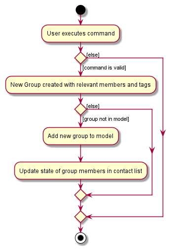

Given below is an example usage scenario and how the `creategroup` mechanism behaves at each step.

Step 1. A valid `creategroup` command is given as user input. This prompts the `LogicManager` to run its execute()
method.

Step 2. The `CreateGroupCommandParser` parses the input and checks for presence of the relevant prefixes.
It also checks that the group name is valid and all members specified are in the contact list.
It returns a `CreateGroupCommand`.

Step 3. `CreateGroupCommand` runs its execute() method which checks if a group with the same name has already been
created. If not, the newly created group is added into the AWE model and all members within the group are updated in
the model. Upon successful execution, `CommandResult` is returned.

The following sequence operation shows how the `creategroup` operation works.
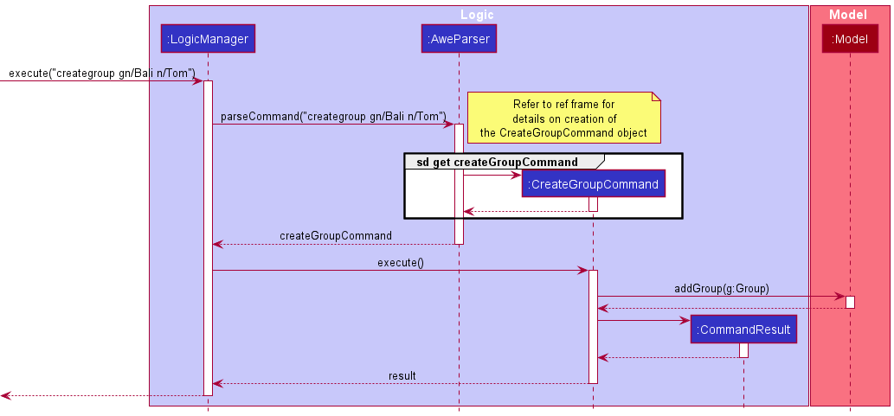

<div markdown="span" class="alert alert-info">:information_source: **Note:** The lifeline for `CreateGroupCommandParser`
should end at the destroy marker (X) but due to a limitation of PlantUML, the lifeline reaches the end of diagram.
</div>

#### Design considerations:

**Aspect: User command for `creategroup`:**

* **Alternative 1 (current choice):** Create Travel Group with specified members and tags.
    * Pros: Intuitive for user to create a travel group with specified members and tags.
    * Pros: Provides user with convenience of setting up a travel group with minimal commands.
    * Cons: Harder to implement.
    * Cons: Easier for user to make an erroneous command.


* **Alternative 2 :** Create Travel Group only.
    * Pros: Easy to implement.
    * Pros: Command has single responsibility. Easy to remember the sole purpose of `creategroup` command.
    * Cons: Unintuitive for user as travel group is created without any members or tags.
    * Cons: Inconvenient for user to use multiple commands to set up a travel group.


* **Justification**
    * User will have at least one member in mind when creating a group.
    * As such, it is only natural for the `creategroup` command to support addition of members and tags into the group
      upon creation.
    * This minimizes the number of commands a user has to make in setting up a functional Group.
    * As such, it is better to choose Alternative 1, as this provides the user with a far better user experience.


### Delete Group Feature

The delete group mechanism is facilitated by maintaining the constraint that every `Group` has a unique `GroupName`.
This allows the `Model` class to easily retrieve the Group based on the name entered by the user and remove the group from the model.

The following activity diagram shows what happens when a user executes a `deletegroup` command.

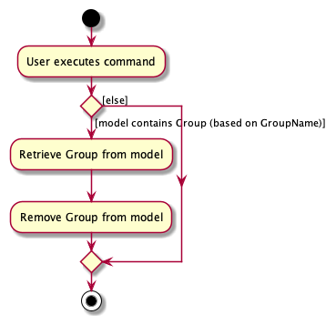

Given below is an example usage scenario and how the `deletegroup` mechanism behaves at each step.

Step 1. A valid `deletegroup` command is given as user input. This prompts the `LogicManager` to run its execute()
method.

Step 2. The `DeleteGroupCommandParser` parses the input and checks for presence of the relevant prefixes.
It also checks that the group name is valid (does not have any non-alphanumeric characters).
It returns a `DeleteGroupCommand`.

Step 3. `DeleteGroupCommand` runs its execute() method which checks if a group with the same name has been
created in the past. If so, this group is retrieved from the model. Subsequently, the group is removed from the addressbook.
Upon successful execution, `CommandResult` is returned.


The following sequence operation shows how the `deletegroup` operation works.
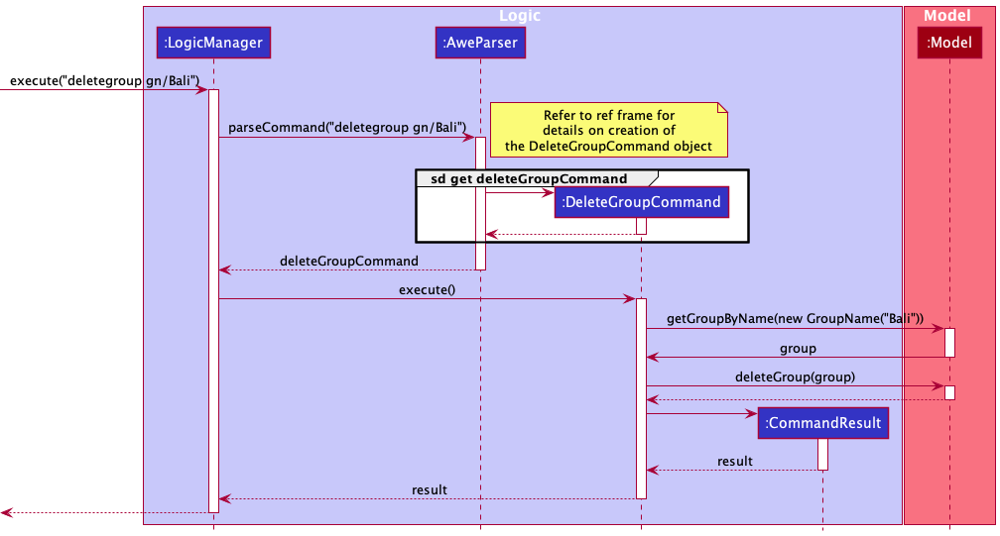

<div markdown="span" class="alert alert-info">:information_source: **Note:** The lifeline for `DeleteGroupCommandParser` should end at the destroy marker (X) but due to a limitation of PlantUML, the lifeline reaches the end of diagram.
</div>

#### Design considerations:

**Aspect: User command for deletegroup:**

* **Alternative 1 (current choice):** Delete based on `GroupName`
    * Pros: Easy to implement.
    * Pros: Difficult for user to make an erroneous command.
    * Cons: Long user command.  
    * Cons: Requires imposition of constraint that group names are unique.
    

* **Alternative 2 (index based):** Delete based on index position in `ObservableList`
    * Pros: Easy to implement.
    * Pros: Short user command  
    * Cons: Unintuitive for user.
    * Cons: Easy for user to make an erroneous command.
    

* **Justification**
    * Group contains large mass of information such as multiple expenses, individual expenditures, and payments.
    * This information is unrecoverable once deleted.
    * As such, it is better to choose Alternative 1, as this makes it difficult for user to accidentally delete a group.

### Find group feature

The find group feature supports both single keyword and multi keyword search. This allows the displayed view panel to show the entries related to the search keywords entered by the user.

The following activity diagram shows what happens when a user executes a `findgroups` command:


Given below is an example usage scenario and how the `findgroup` operation behaves at each step:

Assuming the programs only have the initial data when the user first starts the app, the `FilteredList` should contain only 2 groups - London and Bali.

Step 1. When the user executes `findgroups London` command, the message is passed into `LogicManager` and parsed by `AddressBookParser`.

Step 2. `FindGroupsCommandParser` is created and the arguments are parsed by it. The arguments are used to create `GroupContainsKeywordsPredicate` and `FindGroupsCommand` is returned to the `LogicManager`.

Step 3. The `LogicManager` then calls `FindGroupCommand#execute(model)` method, which updated the `FilteredList<Group>` in `ModelManager`. Thereafter, the `FilteredList<Group>` should contains only London.

Step 4. The GUI listens for updates in the `FilteredList<Group>` and updates the display to display London only.

Step 5. `CommandResult` is returned to the `LogicManager`, which also switches the view panel to `GroupsListPanel` if needed. See UI implementation below for more details of switching view panel.

Step 6. The output from `CommandResult` is then displayed as an output for the user.

The following sequence diagram shows how the `findgroups` operation works:


### Add expense feature

The add expense mechanism is facilitated by defining an Expense model and adding an Expense List field to
`AddressBook`. The Expense model contains a `Person` field containing the payer of the Expense, a `Cost` field
containing the cost of the expense, a `List` of `Person` objects that keeps track of the people involved in the
expense, a `HashMap` that contains details of how much each member has paid in total for the expense.

The following activity diagram shows what happens when a user executes a `addexpense` command.

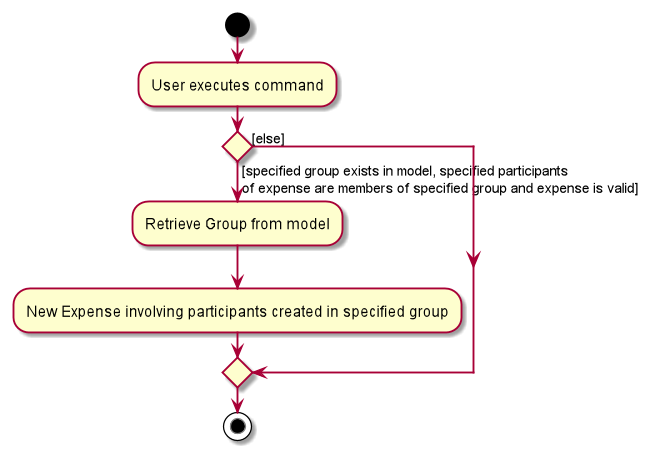

Given below is an example usage scenario and how the `addexpense` mechanism behaves at each step.

Step 1. A valid `addexpense` command is given as user input. This prompts the `LogicManager` to run its execute()
method.

Step 2. The `AddExpenseCommandParser` parses the input and checks for presence of the relevant prefixes.
It also checks that the group name is valid and all members specified are in the specified group.
It returns a `AddExpenseCommand`.

Step 3. `AddExpenseCommand` runs its execute() method which adds the newly created expense involving the into the
relevant group members into the group and the group is updated in the AWE model.Upon successful execution,
`CommandResult` is returned.

The following sequence operation shows how the `addexpense` operation works.
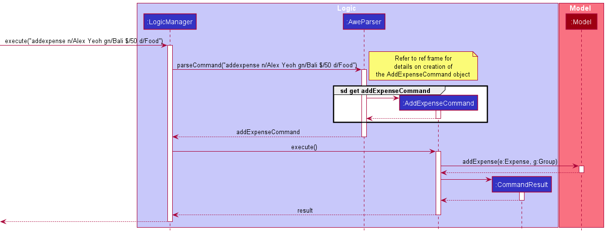

<div markdown="span" class="alert alert-info">:information_source: **Note:** The lifeline for `AddExpenseCommandParser`
should end at the destroy marker (X) but due to a limitation of PlantUML, the lifeline reaches the end of diagram.
</div>

#### Design considerations:

**Aspect: User command for `addexpense`:**

* **Alternative 1 (current choice):** Create Expense with specified group and group members.
    * Pros: Intuitive for user to create an expense with specified group and group members via their names.
    * Pros: Provides user with convenience of creating an expense with minimal input.
    * Cons: Harder to implement.
    * Cons: Easier for user to make an erroneous command.


* **Alternative 2 (index based):** Create Expense with based on index position in `ObservableList`.
    * Pros: Easy to implement.
    * Cons: Inconvenient for user to add an expense as they have to check again the index of both the person and group.
    * Cons: Easy for user to make an erroneous command.

* **Justification**
    * Each person has a unique name and the implementation for adding an expense based on a person's and group's 
      name is simple.
    * Users may need a long time to find the index of a person or group if the list of either is very long.
    * Hence, adding expenses based on the specified person and group name is more appropriate.

### Find Expenses Feature

The find expenses mechanism is facilitated by `Group`. Each group has a unique group name and also an expense list 
required for finding expenses within a group.

The following activity diagram shows what happens when a user executes a `findexpenses` command.


Given below is an example usage scenario and how the `findexpenses` mechanism behaves at each step.

Step 1. The user executes a valid `findexpenses eat gn/London` command. This prompts the `LogicManager` 
to run its execute() method.

Step 2. The `FindExpensesCommandParser` parses the input and checks for presence of the group name prefix.
It also checks that the group name is valid (does not have any non-alphanumeric characters). The arguments are 
used to create `DescriptionContainsKeywordsPredicate` and `FindExpensesCommand` is returned to the `LogicManager`.

Step 3. The `LogicManager` then calls `FindExpensesCommand#execute(model)` method, which updates the 
`FilteredList<Expense>` in `ModelManager` using the predicate created in step 2.

Step 4. The GUI listens for updates in the `FilteredList<Expense>` and updates the display accordingly.

Step 5. `CommandResult` is returned to the `LogicManager`, which also switches the viewpanel to `ExpensesListPanel` if needed.

Step 6. The output from `CommandResult` is then displayed as an output for the user.


The following sequence operation shows how the `findexpenses` operation works.
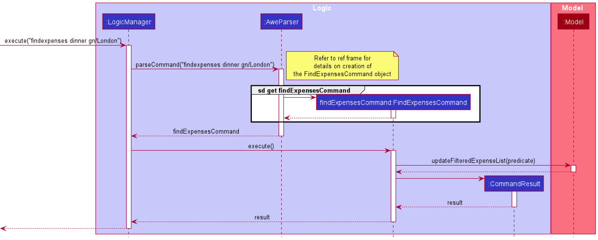

<div markdown="span" class="alert alert-info">:information_source: **Note:** The lifeline for `DeleteGroupCommandParser` should end at the destroy marker (X) but due to a limitation of PlantUML, the lifeline reaches the end of diagram.
</div>

#### Design considerations:

**Aspect: User command for findexpenses:**

* **Alternative 1 (current choice):** Find based on `GroupName`
    * Pros: Easy to implement.
    * Cons: Long user command if group name is long.
    * Cons: Requires imposition of constraint that group names are unique.


* **Alternative 2 (index based):** Find expenses in the group indicated by index position in `ObservableList`
    * Pros: Short user command with just the index.
    * Cons: User need to check for the right index of the group.
    * Cons: Easy for user to make an erroneous command.


* **Justification**
    * Each group has a unique name and the implementation for finding a group based on the group name is simple. 
    * Users may need a long time to find the index of a group if the list of groups is very long.
    * Hence, finding expenses based on the specified group name is more appropriate.


### Delete Expense Feature

The delete expense mechanism is facilitated by the addition of an `ExpenseList` field within the `AddressBook` object maintained by the model.
Each `Expense` belongs to a `Group` object, also maintained within the `AddressBook`.
Deletion of an expense must be accompanied by deletion of the expense from the `Group` object to which it belongs.
The command allows the user to delete an expense based on the index position of the expense in the page viewed by the user.
This means that the user is constrained to only being permitted to delete expenses when they are viewing a list of expenses; that is, after they enter the `findexpenses` or `expenses` command.

The following activity diagram shows what happens when a user executes a `deleteexpense` command.

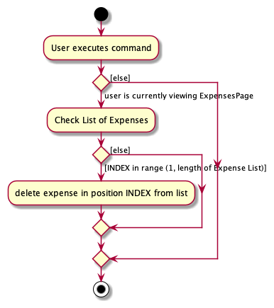

Given below is an example usage scenario and how the `deleteexpense` mechanism behaves at each step.

Step 1. A valid `deleteexpense` command is given as user input. This prompts the `LogicManager` to run its execute()
method.

Step 2. The `DeleteExpenseCommandParser` parses the input and checks for presence of the `INDEX` input.
It returns a `DeleteExpenseCommand`.

Step 3. `DeleteExpenseCommand` runs its execute() method which checks if a group with the `GROUP_NAME` entered by the user has been
created in the past. If so, this group is retrieved from the model. The `Expense` object is retrieved from the

Step 4: Subsequently, the expense is removed from the group to which it belongs, present in the `AddressBook`.
Upon successful execution, `CommandResult` is returned.


The following sequence operation shows how the `deleteexpense` operation works.
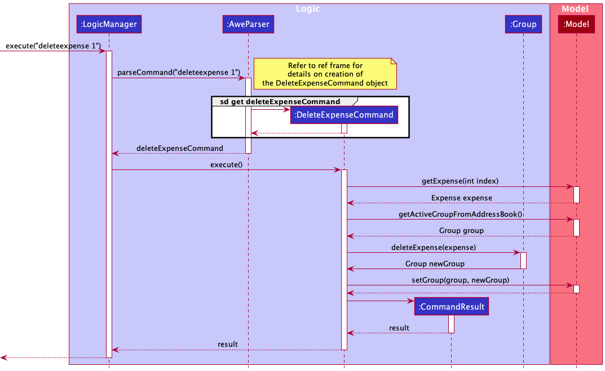

<div markdown="span" class="alert alert-info">:information_source: **Note:** The lifeline for `DeleteExpenseCommandParser` should end at the destroy marker (X) but due to a limitation of PlantUML, the lifeline reaches the end of diagram.
</div>

#### Design considerations

**Aspect: User command for deletegroup:**

* **Alternative 1 (current choice):** Delete based on index position in `ObservableList`
    * Pros: Easy to implement.
    * Pros: Short user command.
    * Cons: Less intuitive for user.
    * Cons: Easy for user to make an erroneous command.

* **Alternative 2 (description based):** Delete based on `description`
    * Pros: Easy to implement.
    * Pros: Difficult for user to make an erroneous command.
    * Cons: Long user command.
    * Cons: Requires imposition of constraint that expense description names are unique.


* **Justification**
    * Expenses, unlike Groups, do not contain a large volume of information.
    * This information is unrecoverable once deleted.
    * However, the damage to a user as a result of an error is not significant. The user can re-enter the details with a single command.
    * Therefore, the need to protect the user from erroneous decisions is not significant.
    * Furthermore, many expenses are likely to have similar descriptions. Constraining users to using unique descriptions for expenses is likely to compromise the user experience.
    * As such, it is better to choose Alternative 1, as this allows the user to quickly delete expenses, and not compromise on the flexibility of the user.

### Calculate Payments Feature

The purpose of this feature is to provide users with a simple set of transactions that would allow all debts within the group to be settled.
The calculate payments UI mechanism is facilitated by the addition of a `PaymentList` field of `Payment` objects, present within the `AddressBook` object maintained by the model.
The functionality of this feature is facilitated by the fact that group objects maintain two hashmaps
* `paidByPayers`, which maintains how much each member of the group has paid during the course of the trip.
* `splitExpenses`, which maintains how much expenditure each member of the group has incurred throughout the trip.
The invariant maintained is that the sum of all payments made (values within `paidByPayers`) should equal the total expenditures incurred by the group (values within `splitExpenses`).


The following activity diagram shows what happens when a user executes a `calculatepayments` command.

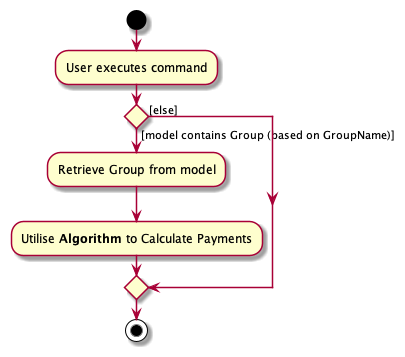

Given below is an example usage scenario and how the `calculatepayments` mechanism behaves at each step.

Step 1. A valid `deleteexpense` command is given as user input. This prompts the `LogicManager` to run its execute()
method.

Step 2. The `CalculatePaymentsCommandParser` parses the input and checks for presence of the `GROUP_NAME` and `INDEX` prefixes.
It checks that the `GROUP_NAME` is valid (does not have any non-alphanumeric characters), and that the index is within the bounds of the length of expenses seen by the user.
It returns a `CalculatePaymentsCommand`.

Step 3. `CalculatePaymentsCommand` runs its execute() method which checks if a group with the `GROUP_NAME` entered by the user has been
created in the past. If so, this group is retrieved from the model. The `Expense` object is retrieved from the

Step 4: Subsequently, the expense is removed from the group to which it belongs, present in the `AddressBook`.
Upon successful execution, `CommandResult` is returned.


The following sequence operation shows how the `calculatepayments` operation works.
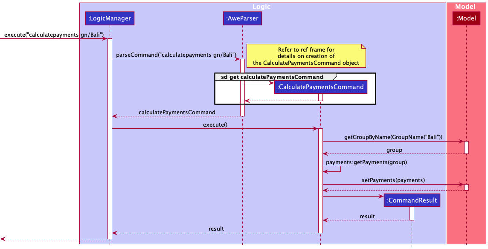

<div markdown="span" class="alert alert-info">:information_source: **Note:** The lifeline for `CalculatePaymentsCommandParser` should end at the destroy marker (X) but due to a limitation of PlantUML, the lifeline reaches the end of diagram.
</div>

#### Design considerations

**Aspect: User command for deletegroup:**

* **Alternative 1 (current choice):** Delete based on index position in `ObservableList`
    * Pros: Easy to implement.
    * Pros: Short user command.
    * Cons: Less intuitive for user.
    * Cons: Easy for user to make an erroneous command.

* **Alternative 2 (description based):** Delete based on `description`
    * Pros: Easy to implement.
    * Pros: Difficult for user to make an erroneous command.
    * Cons: Long user command.
    * Cons: Requires imposition of constraint that expense description names are unique.


* **Justification**
    * Expenses, unlike Groups, do not contain a large volume of information.
    * This information is unrecoverable once deleted.
    * However, the damage to a user as a result of an error is not significant. The user can re-enter the details with a single command.
    * Therefore, the need to protect the user from erroneous decisions is not significant.
    * Furthermore, many expenses are likely to have similar descriptions. Constraining users to using unique descriptions for expenses is likely to compromise the user experience.
    * As such, it is better to choose Alternative 1, as this allows the user to quickly delete expenses, and not compromise on the flexibility of the user.


### UI Display
AWE has multiple lists / views to display such as for `groups`, `contacts` and `expenses`.

The display, called view panel, will only be able to show up 1 view at a time depending on the command. The challenge would be to get it to display the correct one.

To achieve the toggling between each view panels, we implemented the following:
* An enumeration `UiView` to contain the following `CONTACT_PAGE`, `GROUP_PAGE`, `EXPENSE_PAGE`, `TRANSACTION_SUMMARY`, `PAYMENT_PAGE`. Each enum represents a different view.
* `CommandResult` was given 6 more boolean fields, each representing a different view as well.
* `MainWindow` checks for the 6 boolean fields in `CommandResult` and passes `UiView` to `ViewPanel` for toggling the view.

The following activity diagram shows how the `MainWindow` checks and sends the `UiView` to `ViewPanel`.


#### Proposed Implementation
**Aspect: Navigating between different view**

* **Alternative 1**: Make use of JavaFx's tab
    * Pros: Easy to implement.
    * Cons: Unable to fully customised the layout. Have to use the standard JavaFx's tab layout.
  
* **Alternative 2 (current choice)**: Replacing the child of the view panel node<br>
    (Refer to [JavaFx tutorial](https://se-education.org/guides/tutorials/javaFxPart1.html) for more information about JavaFx)
    * Pros: More customisable in terms of layout.
    * Pros: Able to make use of existing codes.
    * Cons: More classes to implement to handle the toggling between views.
    
* **Justification**
    * We want to place the command result display below the buttons according to our [wireframe](https://www.figma.com/file/VwuDOdHr7CSyDUWb4Kwkmx/CS2103T-tP?node-id=0%3A1).
    * Using JavaFx's tab will not let us customise the layout as such.
    * Hence, replacing the child of a view panel is more appropriate.
    
### Ui Navigation Buttons
To improve the usability of AWE, buttons are implemented into the Ui to allow switching of view easily.

However, only 2 views can be toggled by the buttons - Contacts page and Groups page.

To achieve this, the following is implemented:
* 2 buttons (`GroupViewButton` and `ContactViewButton`) for the user to click.
* Event listener for each button - `GroupButtonListener` and `ContactButtonListener`. The event listener works by calling `ViewPanel#toggleView` when the button is clicked.

Given below is an example usage scenario and how the button mechanism behaves at each step. In this example, the button used is `GroupViewButton` but it can also be replaced with `ContactViewButton`.

Step 1. When `GroupViewButton` is initiated, an event listener `GroupButtonListener` is created and used.

Step 2. Once the user clicks on `GroupViewButton`, the event listener will trigger and the `GroupButtonListener#handle` will run. This calls `ViewPanel#toggleView` and passes `UiView.GROUP_PAGE` as parameters. 

Step 3. `ViewPanel` will change the child of itself to `ContactListPanel` (Refer to [JavaFx tutorial](https://se-education.org/guides/tutorials/javaFxPart1.html) for more information about JavaFx). Hence, GUI will update to show contact page


### \[Proposed\] Undo/redo feature

#### Proposed Implementation

The proposed undo/redo mechanism is facilitated by `VersionedAddressBook`. It extends `AddressBook` with an undo/redo history, stored internally as an `addressBookStateList` and `currentStatePointer`. Additionally, it implements the following operations:

* `VersionedAddressBook#commit()` — Saves the current address book state in its history.
* `VersionedAddressBook#undo()` — Restores the previous address book state from its history.
* `VersionedAddressBook#redo()` — Restores a previously undone address book state from its history.

These operations are exposed in the `Model` interface as `Model#commitAddressBook()`, `Model#undoAddressBook()` and `Model#redoAddressBook()` respectively.

Given below is an example usage scenario and how the undo/redo mechanism behaves at each step.

Step 1. The user launches the application for the first time. The `VersionedAddressBook` will be initialized with the initial address book state, and the `currentStatePointer` pointing to that single address book state.


Step 2. The user executes `delete 5` command to delete the 5th person in the address book. The `delete` command calls `Model#commitAddressBook()`, causing the modified state of the address book after the `delete 5` command executes to be saved in the `addressBookStateList`, and the `currentStatePointer` is shifted to the newly inserted address book state.


Step 3. The user executes `add n/David …​` to add a new person. The `add` command also calls `Model#commitAddressBook()`, causing another modified address book state to be saved into the `addressBookStateList`.


<div markdown="span" class="alert alert-info">:information_source: **Note:** If a command fails its execution, it will not call `Model#commitAddressBook()`, so the address book state will not be saved into the `addressBookStateList`.

</div>

Step 4. The user now decides that adding the person was a mistake, and decides to undo that action by executing the `undo` command. The `undo` command will call `Model#undoAddressBook()`, which will shift the `currentStatePointer` once to the left, pointing it to the previous address book state, and restores the address book to that state.


<div markdown="span" class="alert alert-info">:information_source: **Note:** If the `currentStatePointer` is at index 0, pointing to the initial AddressBook state, then there are no previous AddressBook states to restore. The `undo` command uses `Model#canUndoAddressBook()` to check if this is the case. If so, it will return an error to the user rather
than attempting to perform the undo.

</div>

The following sequence diagram shows how the undo operation works:


<div markdown="span" class="alert alert-info">:information_source: **Note:** The lifeline for `UndoCommand` should end at the destroy marker (X) but due to a limitation of PlantUML, the lifeline reaches the end of diagram.

</div>

The `redo` command does the opposite — it calls `Model#redoAddressBook()`, which shifts the `currentStatePointer` once to the right, pointing to the previously undone state, and restores the address book to that state.

<div markdown="span" class="alert alert-info">:information_source: **Note:** If the `currentStatePointer` is at index `addressBookStateList.size() - 1`, pointing to the latest address book state, then there are no undone AddressBook states to restore. The `redo` command uses `Model#canRedoAddressBook()` to check if this is the case. If so, it will return an error to the user rather than attempting to perform the redo.

</div>

Step 5. The user then decides to execute the command `contacts`. Commands that do not modify the address book, such as `contacts`, will usually not call `Model#commitAddressBook()`, `Model#undoAddressBook()` or `Model#redoAddressBook()`. Thus, the `addressBookStateList` remains unchanged.


Step 6. The user executes `clear`, which calls `Model#commitAddressBook()`. Since the `currentStatePointer` is not pointing at the end of the `addressBookStateList`, all address book states after the `currentStatePointer` will be purged. Reason: It no longer makes sense to redo the `add n/David …​` command. This is the behavior that most modern desktop applications follow.


The following activity diagram summarizes what happens when a user executes a new command:


#### Design considerations:

**Aspect: How undo & redo executes:**

* **Alternative 1 (current choice):** Saves the entire address book.
  * Pros: Easy to implement.
  * Cons: May have performance issues in terms of memory usage.

* **Alternative 2:** Individual command knows how to undo/redo by
  itself.
  * Pros: Will use less memory (e.g. for `delete`, just save the person being deleted).
  * Cons: We must ensure that the implementation of each individual command are correct.

_{more aspects and alternatives to be added}_

--------------------------------------------------------------------------------------------------------------------

## **Documentation, logging, testing, configuration, dev-ops**

* [Documentation guide](Documentation.md)
* [Testing guide](Testing.md)
* [Logging guide](Logging.md)
* [Configuration guide](Configuration.md)
* [DevOps guide](DevOps.md)

--------------------------------------------------------------------------------------------------------------------

## **Appendix: Requirements**

### Product scope

**Target user profile**:

* travels in groups
* wants to split expenses in a convenient and efficient manner
* prefer desktop apps over other types
* can type fast
* prefers typing to mouse interactions
* is reasonably comfortable using CLI apps

**Value proposition**:

Travellers have big notes that make settling payments inconvenient.
Most travel groups often designate one person to pay.
This method of settling payments poses a vexing task of splitting costs at the end of the day or on-the-spot.
Our app effectively splits bills between different contacts to serve this purpose.


### User stories

Priorities: High (must have) - `* * *`, Medium (nice to have) - `* *`, Low (unlikely to have) - `*`

| Priority | As a …​                                            | I want to …​                                        | So that I can…​                                                           |
| -------- | ------------------------------------------------- | -------------------------------------------------- | ------------------------------------------------------------------------ |
| `* * *`  | user that has paid for a shared experience        | easily check how much I have paid up front         | ensure I have liquidity for emergencies and or other unforeseen expenses |
| `* * *`  | user who has paid for others                      | easily check how much I am owed by friends         | recoup the money I have paid on their behalf                             |
| `* * *`  | user paying for a shared expense                  | enter the amount I have paid                       | update the total amount they have to pay                                 |
| `* * *`  | user that owes my friend money                    | easily check how much I owe each person            | conveniently proceed to pay my friend                                    |
| `* * *`  | busy user who does not want to remember phone numbers | easily save all my friends' numbers            | conveniently proceed to pay my friend                                    |
| `* * *`  | user with flexible travel plans                   | edit the details of expenditure for events         | modify the records quickly and easily                                    |
| `* * *`  | beginner user                                     | run the app easily with a click of a button        | avoid wasting time trying to figure out how to get the app to work       |
| `* * *`  | inexperienced user in the app who types fast      | type in the commands for the app                   | do more things in the app with the same amount of time compared to using a mouse to click |
| `* * *`  | user who wants an easy workflow                   | easily toggle between contacts and groups page with a command or a click of a button | make my workflow on the app smoother   |
| `* *`    | user who has a number of travel plans             | easily find a group                                | check who still owes me money in the group                               |
| `* *`    | user who has to recoup the money                  | divide up the expenses suitably amongst my friends | know how much to recoup from each person                                 |
| `* *`    | user paying for the shared expense                | see how much I have paid according to the date     | monitor the amount spent each day                                        |
| `* *`    | user who worries about individual expenses        | check the breakdown of my personal expenditure     | keep track of how much money I have spent                                |
| `* *`    | user who likes to differentiate work from leisure | use this app to separate the different types of contacts I have | I won’t mix them up                                         |
| `* *`    | user who wants to stay in contact with friends    | use this app to easily save their phone numbers    | I can remain in contact                                                  |
| `* *`    | potential user exploring the app                  | see the app containing sample data                 | see what the app generally looks like when it is used                    |
| `* *`    | potential user exploring the app                  | undo my actions                                    | test the app's features with the same data                               |
| `* *`    | potential user testing the app                    | run the app on different platforms (windows, linux and os-x) | not have to specifically run a certain platform                |
| `* *`    | user with flexible travel plans                   | delete a group                                     | modify the records easily if plans change                                |
| `* *`    | beginner user who first opened the app            | view the help page                                 | so that I can learn how to use the app                                   |
| `*`      | user who values organisation                      | view the group’s expenditure by categories         | plan the budgeting for future expenses more effectively                  |
| `*`      | user who needs to repay debt                      | easily set up installment payments                 | can avoid paying too much money at one go                                |
| `*`      | user who has lots of contacts to keep track of    | tag each contact                                   | easily find groups of people using the tags                              |
| `* `     | user whose friends frequently change numbers      | use this app to easily edit their numbers or save multiple numbers with notes | easily remember which number to use           |
| `*`      | beginner user that is tech-savvy                  | view the documentation                             | figure out how to use the app                                            |
| `*`      | beginner user                                     | mass add my contacts                               | avoid manually keying in one by one                                      |
| `*`      | beginner user                                     | easily distinguish functions in the app            | use it without the app being too daunting                                |
| `*`      | expert user                                       | create my own shortcuts for commands               | control what I can do with the app more effectively                      |
| `*`      | expert user                                       | mass delete contacts from the app                  | save time by not deleting it manually                                    |
| `*`      | expert user                                       | refer to previous trips and the expenditure        | plan future trips efficiently                                            |

### Use cases

(For all use cases below, the **System** is the `AWE` and the **Actor** is the `user`, unless specified otherwise)


**Use case: Help User Understand Product**

**MSS**

1. User request to find commands and their explanations.
2. AWE shows a list of command keyword(s) and explanations.

**Extensions**

* 2a. AWE detects errant command.
    * 2a1. AWE displays the list of command keyword(s) and explanations.

      Use case ends.
    

**Use case: Add a Person**

**MSS**

1. User chooses to add a person to the AddressBook.
2. User enters add command into CLI along with person name, phone number, email, and address, and tags if applicable.
3. AWE displays confirmation message.

   Use case ends.

**Extensions**

* 2a. AWE detects invalid command format that does not contain all 4 parameter identifiers ("n/", "p/", "e/", "a/").
    * 2a1. AWE returns invalid command format error and displays ```add``` command format and example.

      Use case ends.

* 2b. Command contains 4 parameter identifiers but name is blank.
    * 2b1. AWE reminds user that names should only contain alphanumeric characters and should not be blank.

      Use case ends.

* 2c. Command contains 4 parameter identifiers but phone number is less than 3 digits or not a number.
    * 2c1. AWE reminds user that phone numbers should only contain numbers and be at least 3 digits long.

      Use case ends.

* 2d. Command contains 4 parameter identifiers but email is blank or does not contain domain.
    * 2d1. AWE reminds user of format of email input.

      Use case ends.

* 2e. Command contains 4 parameter identifiers but address is blank.
    * 2e1. AWE reminds user that address can take any values and should not be blank.

      Use case ends.

**Use case: Edit a person**

**MSS**

1. User requests to list persons
2. AWE shows a list of persons
3. User requests to edit a specific person in the list
4. User enters edited information
5. AWE edits the person
    
    Use case ends.

**Extensions**

* 2a. The list is empty.

  Use case ends.

* 3a. The given index is invalid.

    * 3a1. AWE shows an error message.

      Use case resumes at step 2.

* 4a. The given information has an invalid format.

    * 4a1. AWE shows an error message.

      Use case resumes at step 2.
    
**Use case: List all persons**

**MSS**

1. User requests to list persons.
2. AWE shows list of persons. 

   Use case ends. 

**Extensions**

* 2a. There are no persons to be listed.
    * 2a1. AWE does not display any contacts.
      
      Use case ends.


**Use case: Find a person**

**Preconditions: User is in ContactsPage**

**MSS**

1. User request to find person based on keyword(s).
2. AWE shows a list of persons that matches the keyword(s).

**Extensions**

* 2a. There isn't any contacts saved.
    * 2a1. AWE displays nothing in the contacts page.
    * 2a2. AWE shows a message saying no person found.
    
      Use case ends.
      
* 2b. There is not contacts matching the search parameters.
    * 2b1. AWE displays nothing in the contacts page.
    * 2b2. AWE shows a message saying no person found.
    
      Use case ends.


**Use case: Delete a person**

**MSS**

1. User requests to list persons
2. AWE shows a list of persons
3. User requests to delete a specific person in the list
4. AWE deletes the person

    Use case ends.

**Extensions**

* 2a. The list is empty.

  Use case ends.

* 3a. The given index is invalid.

    * 3a1. AWE shows an error message.
    
**Use case: Create Travel Group**

**MSS**

1. User chooses to create a group.
2. User enters create group command into CLI along with group name and names of members.
3. AWE displays confirmation message.

   Use case ends.

**Extensions**

* 2a. AWE detects group member whose name is not in the AddressBook.
  * 2a1. AWE displays message to remind User to type in full name of members as in the AddressBook.
  
    Use case ends.
    
    
**Use case: Delete Travel Group**

**MSS**

1. User chooses to delete a group.
2. User enters delete group command into CLI along with group name.
3. AWE displays confirmation message.

   Use case ends.

**Extensions**

* 2a. AWE detects group name that is not in address book.
    * 2a1. AWE displays message to remind User to type in name of a group inside the addressbook.

      Use case ends.    

**Use case: List all travel groups**

**MSS**

1. User choose to list all groups
2. GroupsPage shows a list of groups

**Extension**
* 2a. AWE detects that there is no group created.
    * 2a1 AWE displays a blank screen.
    
      Use case ends.

**Use case: List expenses of a travel group**

**MSS**

1. User request to list groups.
2. GroupsPage shows a list of groups.
3. User request to see expenses of a specific group.
4. AW3 displays all the expenses of the group.

   Use case ends.

**Extensions**

* 2a. AWE detects no groups created yet.
  * 2a1. AWE displays message to remind User to create a group before empty GroupsPage displayed.
  
    Use case ends.
    
* 3a. The given group name is invalid.
    * 3a1. AWE displays an error.
    
      Use case ends.
      
* 4a. AWE detect no expenses logged under the group.
    * 4a1. AWE displays an empty list.
    
      Use case ends.

**Use case: Find expenses in a travel group**

**MSS**

1. User request to find expense(s) based on keyword(s) and group name.
2. AWE shows a list of expenses in specified group that matches the keyword(s).

**Extensions**

* 2a. The specified group does not exist in AWE.
    * 2a1. AWE shows a message saying that there is no such existing group.

      Use case ends.

* 2b. There are no expenses matching the search parameters.
    * 2b1. AWE displays nothing in the expenses page.
    * 2b2. AWE shows a message saying no expenses are found.

      Use case ends.


**Use case: Find Groups**

*MSS*
1. User request to find groups based on keywords.
2. GroupsPage shows a list of groups that matches the search predicates.
3. AWE displays a message with number of groups found

    Use case ends
    
**Extension**
* 2a. AWE can't find any groups that matches the keywords.
    2a1. GroupsPage shows an empty page
    
    Use case continues


**Use case: Add Expense**

**Preconditions: User has is a member of the specified travel group**

**MSS**

1. User requests to add an expense to the active travel group
2. AWE displays confirmation message.

    Use case ends.

**Extensions**

* 1a. AWE detects that there are no travel groups active.

    * 1a1. AWE informs user that no travel groups are active.
  
      Use case ends.

* 1b. AWE detects that inputted command is an incorrect format.

    * 1b1. AWE informs user that expense was not added and reminds the user of the correct format/

      Use case ends.

**Use case: Delete a shared expense**

**MSS**

1. User requests to list expenses for a travel group.
2. AWE lists all expenses. 
3. User requests to delete an expense at a specific index in the list.
4. AWE deletes the specified expense. 

   Use case ends. 

**Extensions**

* 2a. The expense list is empty.

  Use case ends.

* 3a. The given index is invalid.

    * 3a1. AWE shows an error message.

      Use case resumes at step 2.

**Use case: Clear AddressBook of all entries**

**MSS**

1. User enters clear command.
2. All entries are deleted from AddressBook.

   Use case ends.

### Non-Functional Requirements

1.  Should work on any _mainstream OS_ as long as it has Java `11` or above installed.
2.  Should be able to hold up to 1000 persons without a noticeable sluggishness in performance for typical usage.
3.  A user with above average typing speed for regular English text (i.e. not code, not system admin commands) should be able to accomplish most of the tasks faster using commands than using the mouse.
4.  Should be able to hold up to 100 groups without a noticeable sluggishness in performance for typical usage.
5.  Layout between persons and groups should be intuitive and easy to understand and navigate.
6.  Usage of `$` should be standardized for money.

*{More to be added}*

### Glossary

* **Mainstream OS**: Windows, Linux, Unix, OS-X
* **Private contact detail**: A contact detail that is not meant to be shared with others
* **AddressBook**: The page displaying all the contacts
* **ContactPage**: The page displaying all the contacts
* **GroupsPage**: The page displaying all the travel groups
* **ExpensesPage**: The page displaying all the expenses of a travel group

--------------------------------------------------------------------------------------------------------------------

## **Appendix: Instructions for manual testing**

Given below are instructions to test the app manually.

<div markdown="span" class="alert alert-info">:information_source: **Note:** These instructions only provide a starting point for testers to work on;
testers are expected to do more *exploratory* testing.

</div>

### Launch and shutdown

1. Initial launch

   1. Download the jar file and copy into an empty folder

   1. Double-click the jar file Expected: Shows the GUI with a set of sample contacts. The window size may not be optimum.

1. Saving window preferences

   1. Resize the window to an optimum size. Move the window to a different location. Close the window.

   1. Re-launch the app by double-clicking the jar file.<br>
       Expected: The most recent window size and location is retained.

1. _{ more test cases …​ }_

### Deleting a person

1. Deleting a person while all persons are being shown

   1. Prerequisites: List all persons using the `contacts` command. Multiple persons in the list.

   1. Test case: `delete 1`<br>
      Expected: First contact is deleted from the list. Details of the deleted contact shown in the status message. Timestamp in the status bar is updated.

   1. Test case: `delete 0`<br>
      Expected: No person is deleted. Error details shown in the status message. Status bar remains the same.

   1. Other incorrect delete commands to try: `delete`, `delete x`, `...` (where x is larger than the list size)<br>
      Expected: Similar to previous.

1. _{ more test cases …​ }_

### Search for groups

1. Search for groups in GroupPage
    1. Prerequisites: The preloaded data for groups are not modified. (No groups are removed or added)
    
    1. Test case: `findgroups London`
       Expected: GroupList will list out 1 group with the name 'London'. 1 groups found shown in the status message.
       
    1. Test case: `findgroups London Singapore`
       Expected: GroupList will list out 1 group with the name 'London'. 1 groups found shown in the status message.
    
    1. Test case: `findgroups Singapore`
       Expected: GroupList will display a blank page. 0 groups found shown in status message.
       
2. Search for groups in ContactPage
   1. Prerequisites: The preloaded data for groups are not modified. (No groups are removed or added)
   
   1. Test case: `findgroups London`
      Expected: GroupList displayed. GroupList will list out 1 group with the name 'London'. 1 groups found shown in the status message.
      
   1. Test case: `findgroups London Singapore`
      Expected: GroupList displayed. GroupList will list out 1 group with the name 'London'. 1 groups found shown in the status message.
   
   1. Test case: `findgroups Singapore`
      Expected: GroupList displayed. GroupList will display a blank page. 0 groups found shown in status message.
    
    

### Viewing expenses

1. Viewing all expenses of a travel group

   1. Prerequisites: Have at least one group in the app.

   1. Test case: `expenses gn/London`<br>
      Expected: Expenses under the group named London are displayed. Details of the operation shown in the status message.

   1. Test case: `expenses gn/Test`<br>
      Expected: No expenses displayed as group does not exist. Error details shown in the status message.

   1. Other incorrect delete commands to try: `expenses`, `delete gn/`, `...`
      Expected: Similar to previous.
      


1. _{ more test cases …​ }_

### Saving data

1. Dealing with missing/corrupted data files

   1. _{explain how to simulate a missing/corrupted file, and the expected behavior}_

1. _{ more test cases …​ }_
