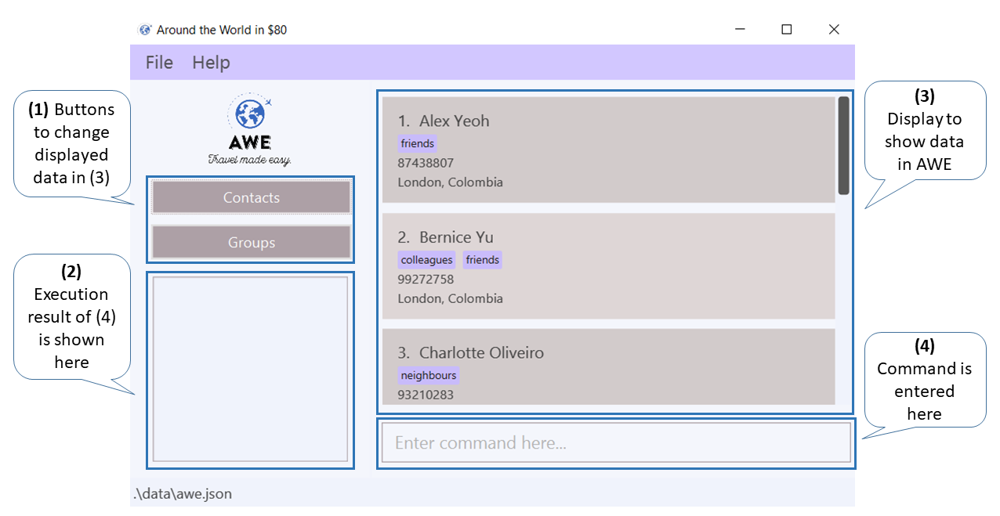
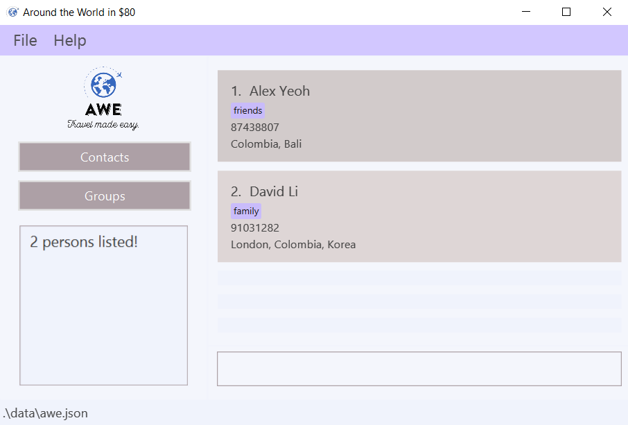
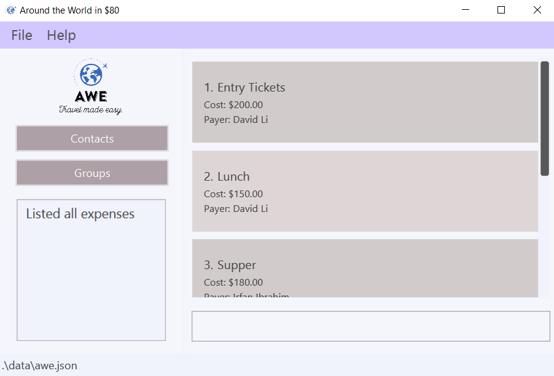
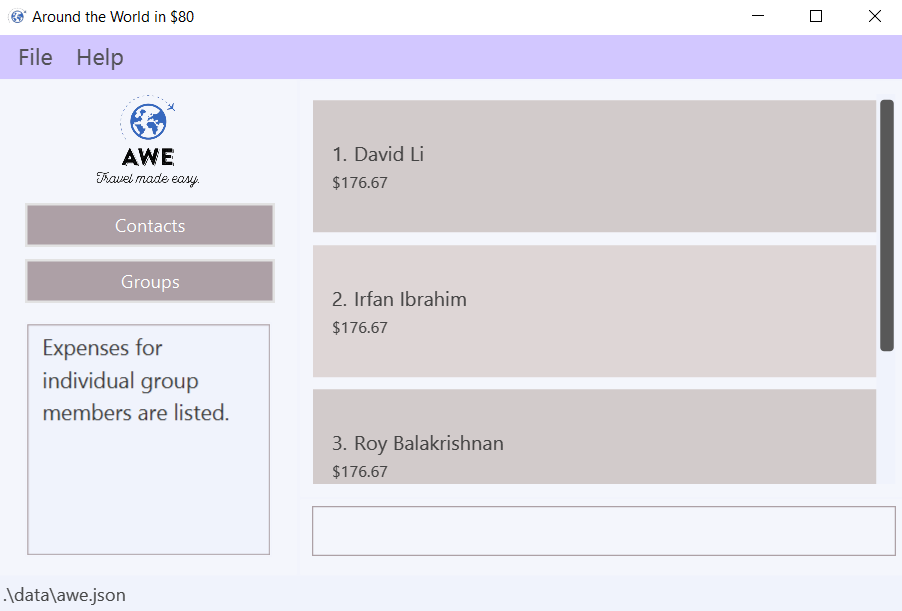
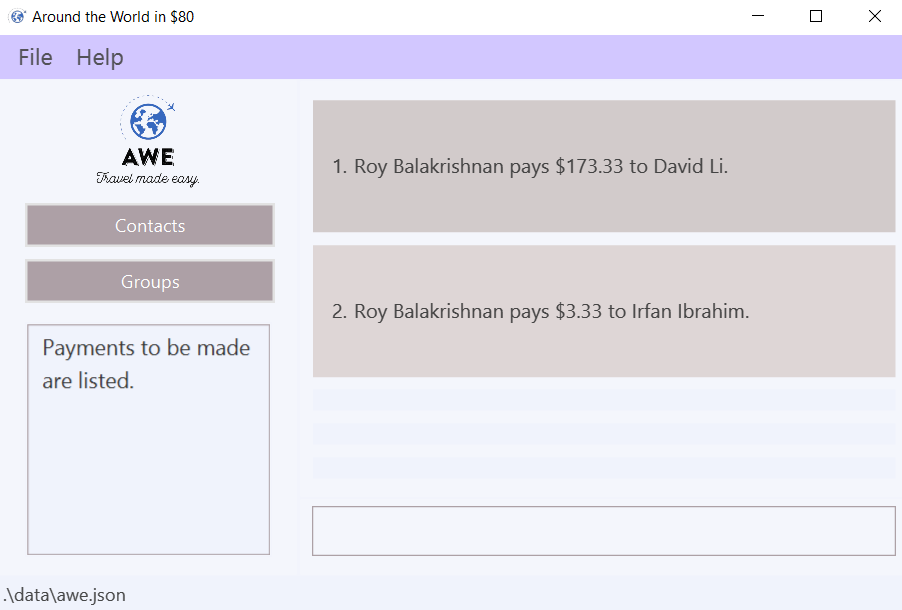

<p align="center">
    
</p>
Around the World in $80 (AWE) is a desktop application for keeping track of spending and expenditure during travels, splitting 
expenses with travel-mates, and facilitating easy recollection of debts at the end of every trip. AWE is the world's
only bespoke app designed for group travellers.

The app promises to revolutionise the group-travel space. With AWE, bills can be split and monitored in a centralised
manner that minimises the potential for disputes and maximises the efficiency of payment and recollection of debts.

AWE's vision is a more interconnected world where relationships are more easily built and maintained.
Our mission is to accomplish through a user-centric approach that seeks to provide the user with what they need, at the
tip of their fingertips. This document marks the first step towards the accomplishment of that mission, and the
beginning of your journey around the world.

<div style="page-break-after: always;" id="tableofcontents"></div>

<p style="font-size: 1.75rem; margin-top: 60px; color: #e46c0a; font-weight:400; margin-bottom: 15px;">Table of Contents</p>
* Table of Contents
{:toc}

<div style="page-break-after: always;"></div>

## 1. About the Document

The purpose of this document is to make sure that you have a pleasant and intuitive experience when using our app.
In line with our user-centric approach, the guide is structured to ensure that the knowledge of the workings of our app
is easily accessible.
The document serves as a guide for users to understand the way to use our app to extract maximum satisfaction.

**To accomplish this, we have taken the following steps**
* We provide you with a glossary of contents to explain away some vocabulary that you might find confusing, so that you 
can focus on exploring AWE to the full extent of its functionalities.
* We provide you with the tools to be able to read this guide with little need for re-referencing previous sections.

[Section 1](#1-about-the-document) provides readers with a brief overview of how to use this document. [Section 2](#2-quick-start) details the setting up of AWE
and [Section 3](#3-features) documents the main features of AWE. If you still face problems using AWE, refer to our FAQ in [Section 4](#4-faq). 
For a summary of all the commands available, refer to [Section 5](#5-command-summary).

<p align="center">
    <a href="#tableofcontents">Click here to return to table of contents</a>
</p>

<div style="page-break-after: always;"></div>

### 1.1 Glossary

Term | Explanation
--------|------------------
**Command Line Interface (CLI)** | The Command Line Interface, or CLI for short, is the user interface on which AWE is based. This means that most of AWE's functionality is unlocked by the typing of inputs by the user, rather than the clicking of a mouse or the selection of options via a menu.
**Graphical User Interface (GUI)** | The Graphical User Interface, or GUI for short, is a user interface which supports all of its features through the clicking of a mouse or the selection of options via a menu. It does not require users to type in commands.
**Command** | Commands are the user inputs that trigger the specific features of the app. Commands are often denoted in highlighted letters. For instance, to create a group, the `creategroup` command is utilised. 
**Parameter** | A Parameter refers to a specific detail required for a command. For instance, adding a contact within an app would require a details such as the contact's name. In this case, the name is a parameter of this command. Parameters are often denoted in the guide in highlighted uppercase letters, for eg. `NAME`.

### 1.2 Format of commands
If you wish to jump straight into using our features, refer to Section 5 for the summary of commands.
Here are some pointers to take note of.
1. Words in `UPPER_CASE` are parameters to be supplied by you.
2. Words that are enclosed in `[   ]` denote optional parameters that the user can choose to enter or leave out.
3. You will notice that our commands require you to use characters such as `n/`, `t/`, etc. This is allows our programme
to locate which words belong to which category of input.

<p align="center">
    <a href="#tableofcontents">Click here to return to table of contents</a>
</p>
<div style="page-break-after: always;"></div>

## 2. Quick start
AWE's primary asset is its speed. Unlike traditional Graphic User Interfaces (GUIs) which rely on slow actions such as mouse clicking and selection of options from long menus, with its CLI, AWE offers users the benefit of speed.
For those who type fast, the app will be faster than most mainstream contact management apps.
For those who are not as fast, familiarity with the commands over time will allow you to harness the full capabilities of AWE.

1. Ensure you have Java `11` or above installed in your Computer. Follow [this guide](https://www.codejava.net/java-se/download-and-install-java-11-openjdk-and-oracle-jdk) to install it.

2. Download the latest `awe.jar` from [here](https://github.com/AY2122S1-CS2103T-F13-1/tp/releases).

3. Copy the file to the folder you want to use as the _home folder_ for your tp.

4. Double-click the file to start the app. The GUI similar to the below should appear in a few seconds. Note how the app contains some sample data.<br>
   
    <p align="center">
        <a href="#tableofcontents">Click here to return to table of contents</a>
    </p>
    <div style="page-break-after: always;"></div>

5. Type the command in the command box and press Enter to execute it. e.g. typing **`help`** and pressing Enter will open the help window.<br>
   Some example commands you can try:

   * **`contacts`** : The command `contacts` lists all contacts.
   
   * **`groups`** : The command `groups` lists all groups.

   * **`expenses`** : The command `expenses gn/London` lists all expenses in the preloaded group `London`.
     
   * **`addcontact`** : The command `addcontact n/John Doe p/98765432` adds a contact named `John Doe` to AWE.

   * **`deletecontact`** : The command `deletecontact 3` removes the 3rd contact shown in the current list.

   * **`creategroup`** : The command `creategroup gn/Bali n/John Doe n/Alex Yeoh t/friends` creates a group named Bali containing members `John Doe` and `Alex Yeoh`, with the tag `friends`.

   * **`deletegroup`** : The command `deletegroup gn/Bali` removes the group named Bali.
   
   * **`addexpense`** : The command `addexpense n/Alex Yeoh gn/Bali $/50 d/drinks` adds an expense paid for by `Alex Yeoh` into the group `Bali` of `$50` for `drinks`.

   * **`deleteexpense`** : The command `deleteexpense 1` removes the 1st expense (by one-based-index) from the list of expenses visible to the user.
   
   * **`transactionsummary `** : The command `transactionsummary  gn/Bali` provides a list of spending made by each user in the group named Bali.

   * **`calculatepayments`** : The command `calculatepayments gn/Bali` provides a list of payments to be made between users to settle debts for the group named Bali.

   * **`clearalldata`** : The command `clearalldata` removes all expenses / contacts / groups.

   * **`editcontact`** : The command `editcontact 1 n/Thomas Betty` edits the name of the 1st contact to be Thomas Betty and removes all existing tags.

   * **`exit`** : The command `exit` exits the app.

6. Refer to the [Features](#features) below for details of each command.

<p align="center">
    <a href="#tableofcontents">Click here to return to table of contents</a>
</p>
<div style="page-break-after: always;"></div>

## 3. Features

<div markdown="block" class="alert alert-info">

**Breakdown of command abbreviations:** <br>

* `d/`: Description (1 to 50 characters in length)
* `gn/`: Group Name (1 to 50 characters in length)
* `n/`: Name (1 to 50 characters in length)
* `p/`: Phone number (3 to 16 digits in length)
* `t/`: Tag (1 to 50 characters in length)
* `$/`: Cost 

**Notes about the command format:**<br>

* Words in `UPPER_CASE` are the parameters to be supplied by the user.<br>
  e.g. in `add n/NAME`, `NAME` is a parameter which can be used as `add n/John Doe`.

* Items in square brackets are optional.<br>
  e.g `n/NAME [t/TAG]` can be used as `n/John Doe t/friend` or as `n/John Doe`.

* Items with `…`​ after them can be used multiple times including zero times.<br>
  e.g. `[t/TAG]…​` can be used as ` ` (i.e. 0 times), `t/friend`, `t/friend t/family` etc.

* Parameters can be in any order other than `addexpenses`. Look at [`addexoense`](#332-adding-a-shared-expense-addexpense) for more details regarding it. <br>
  e.g. if the command specifies `n/NAME p/PHONE_NUMBER`, `p/PHONE_NUMBER n/NAME` is also acceptable.

* If a parameter is expected only once in the command but you specified it multiple times, only the last occurrence of the parameter will be taken.<br>
  e.g. if you specify `p/12341234 p/56785678`, only `p/56785678` will be taken.

* Extraneous parameters for commands that do not take in parameters (such as `help`, `list`, `exit` and `clearalldata`) will be ignored.<br>
  e.g. if the command specifies `help 123`, it will be interpreted as `help`.
  
* Except `findexpenses`, `findgroups`, `findcontacts`, parameters for other commands are case-sensitive.
</div>

<p align="center">
    <a href="#tableofcontents">Click here to return to table of contents</a>
</p>
<div style="page-break-after: always;"></div>

### 3.1. Contacts

#### 3.1.1. Listing all contacts : `contacts`

Shows a list of all contacts in AWE.

Format: `contacts`

#### 3.1.2. Adding a contact: `addcontact`

Adds a contact to AWE.

Format: `addcontact n/NAME p/PHONE_NUMBER [t/TAG]…​`

* Contact list will be displayed after the command succeeded.

* Duplicate contacts cannot be added into AWE
* Contacts are duplicate if they have the same name
* NAME are case-sensitive, "Hans" and "hans" will be treated as 2 separate person. Refer to [FAQ](#4faq) for the rationale behind this.
* NAME are up to 50 characters only.
* TAG are up to 50 characters only.
* PHONE_NUMBER should have between 3 and 16 numbers.
* Contact list will be displayed after the command succeeded.

<div markdown="span" class="alert alert-primary">:bulb: **Tip:**
A contact can have any number of tags (including 0)
</div>

Examples:
* `addcontact n/John Doe p/98765432`
* `addcontact n/Betsy Crowe t/friend p/1234567 t/criminal`

<p align="center">
    <a href="#tableofcontents">Click here to return to table of contents</a>
</p>
<div style="page-break-after: always;"></div>W

#### 3.1.3. Editing a contact : `editcontact`

Edits an existing contact in AWE.

Format: `editcontact INDEX [n/NAME] [p/PHONE] [t/TAG]…​`

* Edits the contact at the specified `INDEX`. The index refers to the index number shown in the displayed contact list. The index **must be a positive integer** 1, 2, 3, …​
* At least one of the optional fields must be provided.
* Since the command edits the contact based on the list visible to the user, it is necessary for the user to be viewing a list of contacts when utilising this command. This means that the user must have entered a `findcontacts` or `contacts` command just prior to entering the `editcontact` command.  
* Existing values will be updated to the input values.
* When editing tags, the existing tags of the contact will be removed i.e adding of tags is not cumulative.
* You can remove all the contact’s tags by typing `t/` without specifying any tags after it.
* NAME are up to 50 characters only.
* TAG are up to 50 characters only.
* PHONE_NUMBER should have between 3 and 16 numbers

Examples:
*  `editcontact 1 p/91234567` Edits the phone number of the 1st contact to be `91234567`.
*  `editcontact 2 n/Betsy Crower t/` Edits the name of the 2nd contact to be `Betsy Crower` and clears all existing tags.


#### 3.1.4. Deleting a contact : `deletecontact`

Deletes the specified contact from AWE.

Format: `deletecontact INDEX`

* Deletes the person at the specified `INDEX`.
* Deletes the person from any groups of which the person was a member. 
* If the contact was the only member of a group, that group will now be deleted.  
* The index refers to the index number shown in the displayed person list.
* The index **must be a positive integer** 1, 2, 3, …​
* Contact list will be displayed after the command succeeded.

Examples:
* `contacts` to display a list of all contacts, followed by `deletecontact 2` deletes the 2nd contact in AWE.
* `findcontacts Betsy` to find all contacts with the name Betsy, followed by `deletecontact 1` deletes the 1st contact in the results of the `findcontacts` command.

<p align="center">
    <a href="#tableofcontents">Click here to return to table of contents</a>
</p>
<div style="page-break-after: always;"></div>

#### 3.1.5. Locating a contact by name: `findcontacts`

Finds contacts whose names contain any of the given keywords.

Format: `findcontacts KEYWORD [MORE_KEYWORDS]`

* The search is case-insensitive. e.g `hans` will match `Hans`
* The order of the keywords does not matter. e.g. `Hans Bo` will match `Bo Hans`
* Only the name is searched.
* Only full words will be matched e.g. `Han` will not match `Hans`
* contacts matching at least one keyword will be returned (i.e. `OR` search).
  e.g. `Hans Bo` will return `Hans Gruber`, `Bo Yang`
* Contact list will be displayed after the command succeeded.

Examples:
* `findcontacts John` returns `john` and `John Doe`
* `findcontacts alex david` returns `Alex Yeoh`, `David Li`<br>
  

<p align="center">
    <a href="#tableofcontents">Click here to return to table of contents</a>
</p>
<div style="page-break-after: always;"></div>

### 3.2. Groups

#### 3.2.1. Listing all groups : `groups`

Shows a list of all groups in GroupPage.

Format: `groups`

#### 3.2.2. Creating a travel group: ```creategroup```
Creates a group of people of your choice from AWE.
Adds you as a member of the group by default.

Format: `creategroup gn/GROUP_NAME n/NAME1 [n/NAME2] [n/NAME3]...[t/TAG1]`

* GROUP_NAME is a mandatory field.
* GROUP_NAME are up to 50 characters only.
* A group with the same name as GROUP_NAME cannot exist for the creation of a group through this command. 
* GROUP_NAME are case-sensitive, "Japan" and "japan" will be treated as 2 separate groups. Refer to [FAQ](#4faq) for the rationale behind this.
* At least one NAME is necessary.
* The names are required to be in AWE and should match contact names exactly.
* Tags cannot have whitespace and special characters other than alphanumeric characters.
* TAG are up to 50 characters only.
* Tags are optional.
* Group list will be displayed after the command succeeded.

Examples:
* `creategroup gn/Bali n/Jacob Tan n/Max Chia n/Julianne Tay`
* `creategroup gn/London n/Justin Lee n/Raj Gopal n/Keith Chia`

<p align="center">
    <a href="#tableofcontents">Click here to return to table of contents</a>
</p>
<div style="page-break-after: always;"></div>

#### 3.2.3. Deleting a travel group: `deletegroup`
Deletes a group from your groups.
All the details from the group are lost once this action is completed.

Format: `deletegroup gn/GROUP_NAME`

* GROUP_NAME is a mandatory field.
* A group with GROUP_NAME as its name must exist.
* GROUP_NAME are up to 50 characters only.
* Group list will be displayed after the command succeeded.

Examples:
* `deletegroup gn/Bali`
* `deletegroup gn/London`

#### 3.2.4. Locating group by name: `findgroups`

Find groups whose names contain any of the given keywords.

Format: `findgroups KEYWORD [MORE_KEYWORDS]`

* The search is case-insensitive. e.g `london` will match `London`
* The order of the keywords does not matter. e.g. `United States` will match `States United`
* Only the group name is searched.
* Only full words will be matched e.g. `London` will not match `Lond`
* Groups matching at least one keyword will be returned (i.e. `OR` search).
  e.g. `Taiwan Malaysia` will return `Taiwan`, `Malaysia`
* Group list will be displayed after the command succeeded.

Examples:
* `findgroups London` returns `London` and `london trip`
* `findgroups Taiwan Malaysia` returns `Taiwan` `Malaysia`<br>
    

<div markdown="span" class="alert alert-primary">
:bulb: **Tip:** You can search for multiple groups by entering more keywords.
</div>

#### 3.2.5. Adding a contact to an existing group: `groupaddcontact`

Add contact in contact list into an existing travel group.

Format: `groupaddcontact gn/GROUP_NAME n/CONTACT_NAME1 [n/CONTACT_NAME2] ...`

* Group name in the user input must already be an existing group.
* The search is case-sensitive. e.g `hans` will not match `Hans`
* Only the name is searched.
* Only full words will be matched e.g. `Han` will not match `Hans`
* Type in the full name of contacts to add.
* Duplicate members in a group/user input will not be added.
* Group list will not be displayed after the command succeeded.

Examples:
* `groupaddcontact gn/Bali n/Irfan Ibrahim` to add Irfan Ibrahim into the Bali travel group.
* `groupaddcontact gn/Prague n/Bernice Yu n/David Li n/Alex Yeoh` to add Bernice Yu, David Li, and Alex Yeoh into the
Prague travel group.

#### 3.2.6. Removing a contact from an existing group: `groupremovecontact`

Remove contact in contact list from an existing travel group.

Format: `groupremovecontact gn/GROUP_NAME n/CONTACT_NAME [n/CONTACT_NAME] ...`

* Group name in the user input must already be an existing group.
* The search is case-sensitive. e.g `hans` will not match `Hans`
* Only the name is searched.
* Only full words will be matched e.g. `Han` will not match `Hans`
* Type in the full name of contacts to remove.
* Members can only be removed if they are in the travel group.
* Group list will not be displayed after the command succeeded.

Examples:
* `groupremovecontact gn/Bali n/Irfan Ibrahim` to remove Irfan Ibrahim from the Bali travel group.
* `groupremovecontact gn/Prague n/Bernice Yu n/David Li n/Alex Yeoh` to remove Bernice Yu, David Li, and Alex Yeoh
from the Prague travel group.

#### 3.2.7. Adding a tag to an existing group: `groupaddtag`

Add tag for an existing travel group.

Format: `groupaddtag gn/GROUP_NAME t/TAG [t/TAG2] ...`

* Group name in the user input must already be an existing group.
* The search is case-sensitive. e.g `bali` will not match `Bali`
* Only full words will be matched e.g. `Bal` will not match `Bali`
* Duplicate tags in a group/user input will not be added.
* TAG are up to 50 characters only.
* Group list will not be displayed after the command succeeded.

Examples:
* `groupaddtag gn/Bali t/Friends` to indicate that the Bali travel group is with friends.
* `groupaddtag gn/Prague t/Family t/Cousins` to indicate that the Prague travel group is with family,
more specifically, cousins.

#### 3.2.8. Removing a tag from an existing group: `groupremovetag`

Remove tag from an existing travel group.

Format: `groupremovetag gn/GROUP_NAME t/TAG [t/TAG2] ...`

* Group name in the user input must already be an existing group.
* Tag has to be in existing group before it can be removed.
* TAG are up to 50 characters only.
* The search is case-sensitive. e.g `bali` will not match `Bali`
* Only full words will be matched e.g. `Bal` will not match `Bali`
* Duplicate tags in a group/user input will not be removed.
* Group list will not be displayed after the command succeeded.

Examples:
* `groupremovetag gn/Bali t/Friends` to remove the friends tag from the Bali travel group.
* `groupremovetag gn/Prague t/Family t/Cousins` to the tags family and cousins from the Prague travel group.

#### 3.2.9. Editing travel group name: `groupeditname`

Edit group name for an existing travel group.

Format: `groupeditname gn/OLD_GROUP_NAME gn/NEW_GROUP_NAME`

* Group name in the user input must already be an existing group.
* The search is case-sensitive. e.g `bali` will not match `Bali`
* Only full words will be matched e.g. `Bal` will not match `Bali`
* GROUP_NAME are up to 50 characters only.
* Group list will not be displayed after the command succeeded.

Examples:
* `groupeditname gn/Bali gn/Thailand` to change the group name from Bali to Thailand.
* `groupeditname gn/Germany gn/Munich` to change the group name from Germany to Munich.

<br>
[Click here to return to table of contents](#tableofcontents)
<br>
--------------------------------------------------------------------------------------------------------------------
<div style="page-break-after: always;"></div>

### 3.3. Expenses

#### 3.3.1. Listing expenses of a specified group: `expenses`

Shows a list containing all existing expenses within the specified travel group. Expenses are sorted from most recent to least recent.

Format: `expenses gn/GROUP_NAME`

* GROUP_NAME argument is mandatory.
* GROUP_NAME must correspond to the name of an existing travel group.

Examples: 
* `expenses gn/London` shows all the expenses of the group named London.



#### 3.3.2. Adding a shared expense: `addexpense`
Adds a shared expense to the specified travel group.
The expense can be paid for and split among any number of contacts within the travel group.

Format: `addexpense n/PAYER_NAME gn/GROUP_NAME $/TOTAL_AMOUNT_PAID d/DESCRIPTION [n/PAYEE_WHO_MADE_A_PERSONAL_PAYMENT] [$/PAYEE'S_PERSONAL_PAYMENT_TO_EXCLUDE_FROM_TOTAL_AMOUNT] [ex/PERSON_TO_EXCLUDE_FROM_EXPENSE]`

* There should be only one PAYER_NAME in the command.
* PAYER_NAME must be immediately followed by the GROUP NAME.
* By default, all members of the group will be included in the expense.
* The names are required to be in AWE.
* The names are required to be in the specified group.
* COST has a limit of ten million and any addition or entering of COST more than ten million will result in it defaulting to a cost of ten million.
* COST should only have a maximum of two decimal places, otherwise the COST will be rounded off to the nearest two decimal places.
* COST should not be negative.
* DESCRIPTION does not need to be unique.
* Each personal payment has to be a name immediately followed by the amount of the personal payment.
* Expense list of the group will not be displayed after the command succeeded.

Examples:
* `addexpense n/Nic gn/Catch up $/50 d/Movie and dinner`
* `addexpense n/Tom gn/Date $/60 d/Big meal but Jerry wants to pay for his own Coke n/Jerry $/2`
* `addexpense n/Keith gn/Movie night $/40 d/For movie but Kelly didn't watch ex/Kelly`
* `addexpense n/Jerry gn/Catch up $/50 d/dinner n/Tom $/20 ex/Ryan`

#### 3.3.3. Deleting a shared expense: `deleteexpense`

Deletes a shared expense from a travel group.
This command deletes the expense for all members involved in the expense.

Format: `deleteexpense INDEX`

* INDEX argument is mandatory.
* INDEX has to be between 1 and the length of the list of expenses visible to the user on the screen.
* Since the command deletes the expense based on the list visible to the user, it is necessary for the user to be viewing a list of expenses when utilising this command. This means that the user must have entered a `findexpenses` or `expenses` command just prior to entering the `deleteexpense` command. 
* Expense list of the group will remain to be displayed after the command succeeded.

Examples:
* `deleteexpense 1`
* `deleteexpense 2`

#### 3.3.4. Locating a shared expense by description: `findexpenses`

Finds expenses within the specified group which descriptions contain any of the given keywords.

Format: `findexpenses KEYWORD [MORE_KEYWORDS] gn/GROUP_NAME`

* The search is case-insensitive. e.g `dinner` will match `Dinner`
* The order of the keywords does not matter. e.g. `Dinner Transportation` will match `Transportation Dinner`
* Only the description is searched.
* Only full words will be matched e.g. `Dinner` will not match `Dinners`
* Expenses matching at least one keyword will be returned (i.e. `OR` search).
  e.g. `Dinner Transportation` will return `Friday dinner`, `Transportation tickets`
* Expense list of the group will be displayed after the command succeeded.

Examples:
* `findexpenses dinner gn/London` returns `dinner` and `Friday dinner` in the group `London`
* `findexpenses lunch souvenirs gn/London` returns `lunch`, `souvenirs`in the group `London`<br>

#### 3.3.5 Calculating total spending of each user: `transactionsummary`
Displays a list of individual spending for each user in the group.

Format: `transactionsummary gn/GROUP_NAME`

* GROUP_NAME is a mandatory field.
* A group with GROUP_NAME as its name must exist.

Examples:
* `transactionsummary gn/Bali`
* `transactionsummary gn/London`


#### 3.3.6. Calculating payments to make: `calculatepayments`
Uses the net spend of the user on the trip to tabulate a fast set of payments to settle the debts between members of the group.

Format: `calculatepayments gn/GROUP_NAME`

* GROUP_NAME is a mandatory field.
* A group with GROUP_NAME as its name must exist.
* Output e.g. [`John pays Mark $20.50`, `Sara pays Dev $15`]

Examples:
* `calculatepayments gn/Bali`
* `calculatepayments gn/London`<br>
  
  
**Note: When a `Person` is deleted from contacts or removed from the group, the functioning of this command does not change. The deleted person may still be part of the list of payments depending on the expenses they had previously.**


<br>
[Click here to return to table of contents](#tableofcontents)
<br>

--------------------------------------------------------------------------------------------------------------------
<div style="page-break-after: always;"></div>

### 3.4. Miscellaneous

#### 3.4.1. Viewing help : `help`

Shows a message explaining how to access the help page.


Format: `help`

#### 3.4.2. Clearing all entries : `clearalldata`

Clears all entries from AWE.

Format: `clearalldata`

* After clearing of data, `contacts` page will be shown

#### 3.4.3. Exiting the program : `exit`

Exits the program.

Format: `exit`

#### 3.4.4. Saving the data

AWE data are saved in the hard disk automatically after any command that changes the data. There is no need to save manually.

#### 3.4.5. Editing the data file

AWE data are saved as a JSON file `[JAR file location]/data/awe.json`. Advanced users are welcome to update data directly by editing that data file.

<div markdown="span" class="alert alert-warning">
:exclamation: **Caution:**
If your changes to the data file makes its format invalid, AWE will discard all data and start with an empty data file at the next run.
</div>

<br>
[Click here to return to table of contents](#tableofcontents)
<br>
--------------------------------------------------------------------------------------------------------------------
<div style="page-break-after: always;"></div>

## 4. FAQ
**Q**: Why is NAME case-sensitive?
**A**: Since identical names are very common in many cultures, we have decided to allow the addition of 2 contacts such as "jun jie" and "Jun Jie" in order to keep track of their numbers. 
Furthermore, since AWE deals with overseas travels, quite a number of travellers might get a new overseas number when they are travelling. This will allow users to keep track of both
their local and overseas local separately. Deleting the number after returning from the trip will be easier as well. In both cases, users can distinguish the 2 contacts with similar names using tags.
This is also consistent with most mobile-phones, wherein contact names are case sensitive.
To address the overseas number use case, for our next release, we are considering providing users with the ability to input more than one phone number when adding a contact.

**Q**: Why is GROUP_NAME case-sensitive?
**A**: Similar to the above question, a user might travel to the same destination more than once. 
This will allow the addition of each individual trips.
To address, this use case, we are considering requiring a DATE_TIME parameter when creating a group. 
We did not do so for this release due to concerns that two separate groups of users might be on a trip at the same location in the same time frame.
In this case, users might be unable to create two groups, even though the use case would merit such an action.

**Q**: How do I transfer my data to another computer?<br>
**A**: Install AWE on the other computer and replace the empty data file it creates with the data file used by the AWE on your previous computer.

**Q**: What if the Jar file does not open properly when I double click on it?<br>
**A**: Open a command prompt in that folder and run the command `java -jar -ea AWE.jar`.

**Q**: What do I do if I see `AWE.jar` cannot be opened because it is from an unidentified developer when I double click the jar file on a mac?<br>
**A**: Go to `System Preferences -> Security and Privacy -> General` and click on `Open anyways` as such<br>

<br>
If your questions are not answered in the FAQ, check out the issue page on our GitHub linked [here](https://github.com/AY2122S1-CS2103T-F13-1/tp/issues).

<br>
[Click here to return to table of contents](#tableofcontents)
<br>
--------------------------------------------------------------------------------------------------------------------
<div style="page-break-after: always;"></div>

## 5. Command summary

### 5.1 Contacts commands

Action | Format, Examples
--------|------------------
**View Contacts** | `contacts`
**Add Contact** | `addcontact n/NAME p/PHONE_NUMBER [t/TAG]…​` <br> e.g., `add n/James Ho p/22224444 t/friend t/colleague`
**Delete Contact** | `deletecontact INDEX`<br> e.g., `delete 3`
**Edit Contact** | `editcontact INDEX [n/NAME] [p/PHONE_NUMBER] [t/TAG]…​`<br> e.g.,`edit 2 n/James Lee`
**Find Contacts** | `findcontacts KEYWORD [MORE_KEYWORDS]`<br> e.g., `findcontacts James Jake`


<div style="page-break-after: always;"></div>

### 5.2 Groups commands


Action | Format, Examples
--------|------------------
**View Groups** | `groups`
**Create Group** | `creategroup gn/GROUP_NAME n/NAME1 n/NAME2 n/NAME3...t/TAG1` <br> e.g., `creategroup gn/Bali n/Jacob Tan n/Max Chia n/Julianne Tay t/friends`
**Delete Group** | `deletegroup gn/GROUP_NAME` <br> e.g., `deletegroup gn/Vienna`
**Add Contact to Group** | `groupaddcontact gn/GROUP_NAME n/NAME1 [n/MORE_NAMES]` <br> e.g., `groupaddcontact gn/Bali n/Jacob Tan`
**Add Tags to Group** | `groupaddtag gn/GROUP_NAME n/TAG1 [n/MORE_TAGS]` <br> e.g., `groupaddtag gn/Bali n/friends`
**Edit Group Name** | `groupeditname gn/OLD_GROUP_NAME gn/NEW_GROUP_NAME` <br> e.g., `groupedittag gn/Bali gn/Hanoi`
**Remove Tags from Group** | `groupremovetag gn/GROUP_NAME n/TAG1 [n/MORE_TAGS]` <br> e.g., `groupremovetag gn/Bali n/friends`
**Remove Contact from Group** | `groupremovecontact gn/GROUP_NAME n/NAME1 [n/MORE_NAMES]` <br> e.g., `groupremovecontact gn/Bali n/Jacob Tan`
**Find Groups** | `findgroups KEYWORD [MORE_KEYWORDS]`<br> e.g., `findgroups James Jake`

<div style="page-break-after: always;"></div>

### 5.3 Expense commands

Action | Format, Examples
--------|------------------
**View Expense** | `expense INDEX` <br> e.g., `expense 2`
**Add Expense** | `addexpense n/PAYER_NAME gn/GROUP_NAME $/TOTAL_AMOUNT_PAID d/DESCRIPTION [n/PAYEE_WHO_MADE_A_PERSONAL_PAYMENT] [$/PAYEE'S_PERSONAL_PAYMENT_TO_EXCLUDE_FROM_TOTAL_AMOUNT] [ex/PERSON_TO_EXCLUDE_FROM_EXPENSE]` <br> e.g., `addexpense n/Alex Yeoh gn/London $/50 d/Dinner n/Bernice Yu $/2 ex/David Li`
**Delete Expense** | `deleteexpense INDEX` <br> e.g., `deleteexpense 1`
**Find Expenses** | `findexpenses KEYWORD [MORE_KEYWORDS] gn/GROUP_NAME`<br> e.g., `findexpenses dinner buffet gn/London`
**Calculate Spending** | `transactionsummary gn/GROUP_NAME` <br> e.g., `transactionsummary gn/Bali` 
**Calculate Payments** | `calculatepayments gn/GROUP_NAME` <br> e.g., `calculatepayments gn/Bali` 

### 5.4 Miscellaneous Commands

Action | Format, Examples
--------|------------------
**Clear Data** | `clearalldata`
**Help** | `help`

<br>
[Click here to return to table of contents](#tableofcontents)
<br>
--------------------------------------------------------------------------------------------------------------------
<div style="page-break-after: always;"></div>

## 6. Final Word
AWE hopes to revolutionise the group-travel space through its effective handling of shared expenses on a centralised
platform to maximise the efficiency of payment and recollection of debts. Our team is committed to delivering a seamless 
experience for potential users. We are always looking to improve. As such, do drop us an email at <a href = "mailto: awe80contact@gmail.com">awe80contact@gmail.com</a>
if you discover any bugs while using the application.

<br>
[Click here to return to table of contents](#tableofcontents)
<br>
